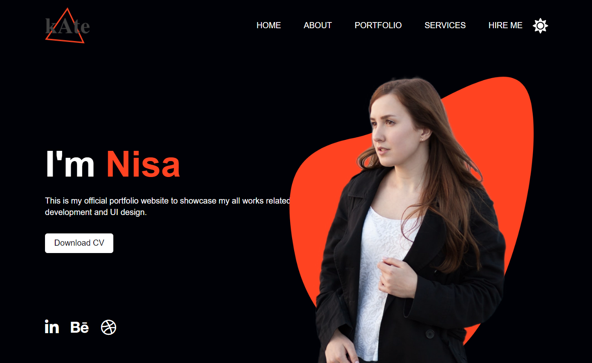

# Dark Mode Portfolio 🌙

## Overview
This project showcases a portfolio website for Nisa Gökdemir with a built-in dark mode functionality. The website features a clean design, navigation bar, personal information, portfolio sections, and social links. Users can toggle between light and dark modes.

## Technologies Used 🚀
- **HTML**
- **CSS**
- **JavaScript**
- **Font Awesome Icons**

## Features ✨
- Responsive navigation bar with a logo.
- Introduction section with a dynamic background image.
- Portfolio sections for showcasing works.
- Social links with Font Awesome icons.
- Dark mode toggle functionality.

## Usage 💻
1. Click the "Moon" icon in the navigation bar to switch to dark mode.
2. Toggle back to light mode by clicking the "Sun" icon.

## Live Demo 🌐
Live Demo: [Dark Mode Portfolio Demo](https://website-darkmode.vercel.app/)

## Installation
No special installation is required for this project. Simply open the `index.html` file in a web browser.

## Dark Mode Toggle
- Click on the moon/sun icon in the navigation bar to switch between dark and light modes.

## Contributing 🤝
Feel free to use, modify, and contribute to the project! If you have any questions or feedback, you can reach me at your nisagokdemir@gmail.com

## License
This project is licensed under the **MIT License**.

